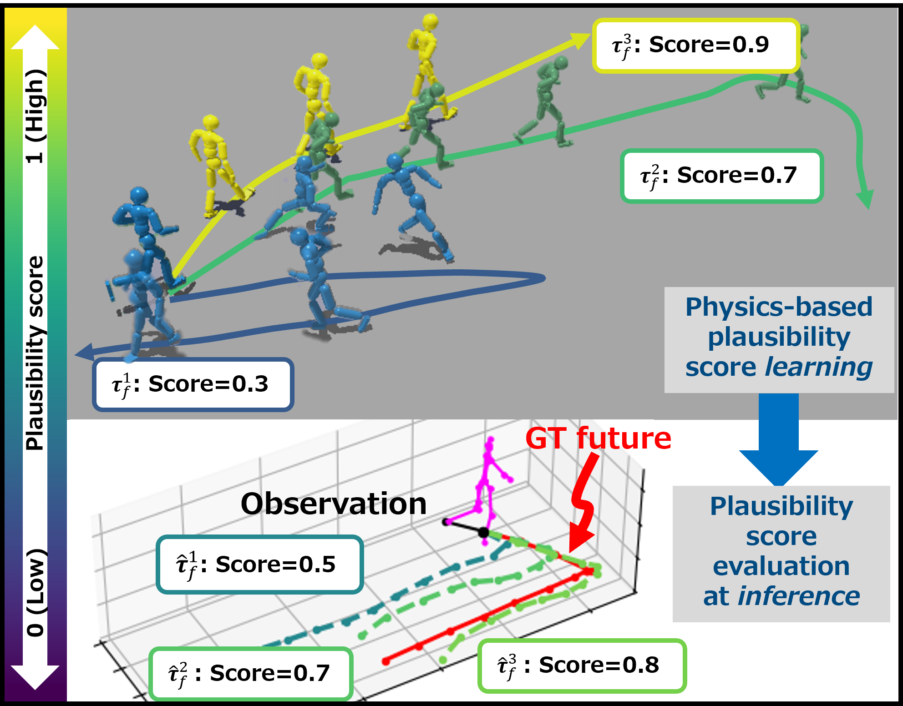

<div align="center">
    
</div>

# 🚶‍➡️[EmLoco](https://iminthemiddle.github.io/EmLoco-Page/#)🏃‍➡️
> [!Note]
> This is an implementation of the paper: **Physical Plausibility-aware Trajectory Prediction via Locomotion Embodiment (CVPR2025 main).**
>   - Author: [Hiromu Taketsugu](https://iminthemiddle.github.io/), [Takeru Oba](https://obat2343.wixsite.com/my-site), [Takahiro Maeda](https://meaten.github.io/), [Shohei Nobuhara](https://shohei.nobuhara.org/index.en.html), [Norimichi Ukita](https://www.toyota-ti.ac.jp/Lab/Denshi/iim/ukita/index.html)
>   - [Project page](https://iminthemiddle.github.io/EmLoco-Page/#)
>   - [arXiv](https://arxiv.org/abs/2503.17267)

> [!Important]
> This repo’s in progress — hope you stay tuned!
> 
> ✅ToDos:
> - [x] Release the paper on arXiv: [arXiv](https://arxiv.org/abs/2503.17267)
> - [x] Release a project page: [Project page](https://iminthemiddle.github.io/EmLoco-Page/#)
> - [x] Release this codebase
> - [ ] Provide the pre-trained models
> - [ ] Provide the instruction and processed files for pose conversion
> - [ ] Add a link to CVF Open Access Repository

## 📑Abstract
*Humans can predict future human trajectories even from momentary observations by using human pose-related cues. However, previous **Human Trajectory Prediction (HTP)** methods leverage the pose cues implicitly, resulting in implausible predictions. To address this, we propose **Locomotion Embodiment**, a framework that explicitly evaluates the physical plausibility of the predicted trajectory by locomotion generation under the laws of physics. While the plausibility of locomotion is learned with an indifferentiable physics simulator, it is replaced by our differentiable **Locomotion Value function** to train an HTP network in a data-driven manner. In particular, our proposed **Embodied Locomotion loss** is beneficial for efficiently training a stochastic HTP network using multiple heads. Furthermore, the **Locomotion Value filter** is proposed to filter out implausible trajectories at inference. Experiments demonstrate that our method further enhances even the state-of-the-art HTP methods across diverse datasets and problem settings.*

## ⬇️Installation
> [!Note]
> - Python 3.10.7
> - CUDA 12.1
> Other versions have not been tested.

1. Please follow the instruction of [PACER](https://github.com/nv-tlabs/pacer) and set up [IsaacGym](https://developer.nvidia.com/isaac-gym).
2. Please follow the instruction of [Social-Transmotion](https://github.com/vita-epfl/social-transmotion) and download [JTA](https://github.com/fabbrimatteo/JTA-Dataset) and [JRDB](https://github.com/vita-epfl/JRDB-Traj) datasets.
3. Please follow the instruction of [Pose to SMPL](https://github.com/Dou-Yiming/Pose_to_SMPL) (no need to download datasets other than above).
4. Please download the Preprocessed Keypoints from [human-scene-transformer](https://github.com/google-research/human-scene-transformer/tree/main/human_scene_transformer/data).
- In my case, different virtual environments are used for each of PACER, Socal-Transmotion, and Pose to SMPL.
    
## 🌐Data Preparation
> [!Warning]
> These processes should be done in the Pose to SMPL environment.

**Coming soon!**

## 🚀Quick Start
<summary><bold>LocoVal function training in a physics simulator</bold></summary>

> [!Warning]
> These processes should be done in the PACER environment.
    
1. **Pretrain the locomotion generation policy network**
    ```
    python ./scripts/posetrack_train.py --cfg ./configs/posetrack21/{CONFIG_FILE} --exp-id {EXP_ID}
    ```
2. **Train the Locomotion Value function**
    ```
    python ./scripts/posetrack_train.py --cfg ./configs/posetrack21/{CONFIG_FILE} --exp-id {EXP_ID}
    ```

<summary><bold>Human trajectory prediction using EmLoco loss and LocoVal filter</bold></summary>

> [!Warning]
> These processes should be done in the Social-Transmotion environment.
> If you want to train/evaluate in the JRDB dataset, you just need to replace "jta" with "jrdb".

1. **Train the Social-Transmotion with the EmLoco loss**
    ```
    python train_jta.py --exp_name ANY_EXP_NAME --valueloss_w ANY_WEIGHT
    ```
    - If you want to train the multi-head predictor, please add "--multi_modal" and specify the number of modes in the config file.
    - Also, you can specify the weight of the LocoVal function in the config file.
3. **Evaluate the trained Social-Transmotion**
    ```
    python evaluate_jta.py --exp_name ANY_EXP_NAME
    ```
    - If you want to test the multi-head predictor, please add "--multi_modal".
    - Also, you can save the prediction results for visualization by adding "--vis".
4. **(Optional) Visualize the prediction results**
    ```
    python visualize_pred.py --save_name ANY_SAVE_NAME
    ```
    - You can specify the prediction results to visualize by "paths" in the script.

## 🔍Citation
**If you found this code useful, please consider citing our work ;D**

```
@InProceedings{EmLoco_CVPR25,
  author       = {Taketsugu, Hiromu and Oba, Takeru and Maeda, Takahiro and Nobuhara, Shohei and Ukita, Norimichi},
  title        = {Physical Plausibility-aware Trajectory Prediction via Locomotion Embodiment},
  booktitle    = {IEEE / CVF Computer Vision and Pattern Recognition Conference (CVPR)},
  year         = {2025}}
```

## 🤗Acknowledgement
This project repository builds upon the shoulders of giants.
Huge thanks to these awesome works!
- [PACER](https://github.com/nv-tlabs/pacer) and [IsaacGymEnvs](https://github.com/isaac-sim/IsaacGymEnvs) for locomotion generation in physics-simulator.
- [Social-Transmotion](https://github.com/vita-epfl/social-transmotion) and [EqMotion](https://github.com/MediaBrain-SJTU/EqMotion) for trajectory prediction.
- [JTA-Dataset](https://github.com/fabbrimatteo/JTA-Dataset) and [JRDB-Traj](https://github.com/vita-epfl/JRDB-Traj) for datasets.
- [Pose to SMPL](https://github.com/Dou-Yiming/Pose_to_SMPL) and [human-scene-transformer](https://github.com/google-research/human-scene-transformer/tree/main/human_scene_transformer/data) for SMPL pose conversion.
