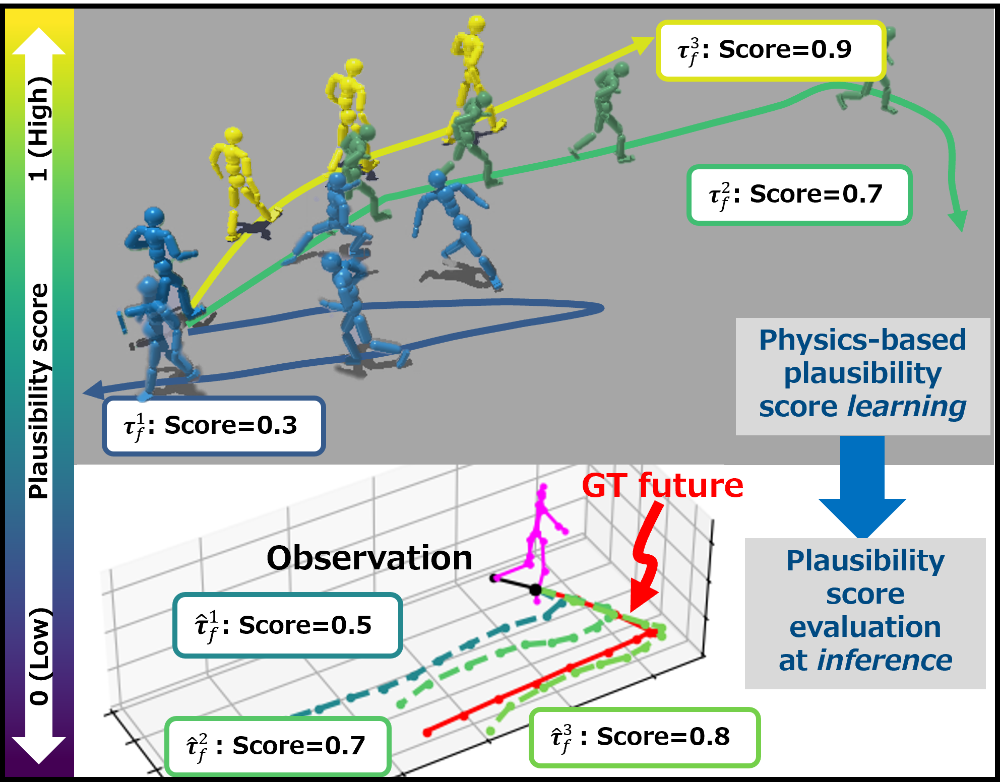

<div align="center">
    
</div>

# 🚶‍➡️[EmLoco](https://iminthemiddle.github.io/EmLoco-Page/#)🏃‍➡️

> [!Note]
> Official implementation of **Physical Plausibility-aware Trajectory Prediction via Locomotion Embodiment** (CVPR 2025 main).
> - Authors: [Hiromu Taketsugu](https://iminthemiddle.github.io/), [Takeru Oba](https://obat2343.wixsite.com/my-site), [Takahiro Maeda](https://meaten.github.io/), [Shohei Nobuhara](https://shohei.nobuhara.org/index.en.html), [Norimichi Ukita](https://www.toyota-ti.ac.jp/Lab/Denshi/iim/ukita/index.html)
> - [Project page](https://iminthemiddle.github.io/EmLoco-Page/#) · [CVF Open Access](https://openaccess.thecvf.com/content/CVPR2025/html/Taketsugu_Physical_Plausibility-aware_Trajectory_Prediction_via_Locomotion_Embodiment_CVPR_2025_paper.html) · [arXiv](https://arxiv.org/abs/2503.17267) · [YouTube](https://youtu.be/OYLDYinc9DU?si=ztusWEL1M7qB21UI) · [🤗 Hugging Face assets](https://huggingface.co/iminthemiddle/EmLoco)

## 📑Abstract
*Humans can predict future human trajectories even from momentary observations by using human pose-related cues. However, previous **Human Trajectory Prediction (HTP)** methods leverage the pose cues implicitly, resulting in implausible predictions. To address this, we propose **Locomotion Embodiment**, a framework that explicitly evaluates the physical plausibility of the predicted trajectory by locomotion generation under the laws of physics. While the plausibility of locomotion is learned with an indifferentiable physics simulator, it is replaced by our differentiable **Locomotion Value function** to train an HTP network in a data-driven manner. In particular, our proposed **Embodied Locomotion loss** is beneficial for efficiently training a stochastic HTP network using multiple heads. Furthermore, the **Locomotion Value filter** is proposed to filter out implausible trajectories at inference. Experiments demonstrate that our method further enhances even the state-of-the-art HTP methods across diverse datasets and problem settings.*

## 🗂️Repository Layout

```
EmLoco/
├── social-transmotion/   # Trajectory + pose prediction backbone (Social-Transmotion w/ EmLoco loss & filter)
├── pacer/                # Pedestrian Animation Controller + LocoVal function training (IsaacGym)
├── joints2smpl/          # 3D-keypoint -> SMPL pose conversion (used to build pose-conditioned input)
├── EqMotion/             # Alternative trajectory backbone (ETH/UCY benchmark)
├── isaacgym/             # NVIDIA Isaac Gym source (binaries must be obtained separately, see Installation)
├── pyproject.toml        # Unified uv environment definition (Python 3.8 + CUDA 12.1)
├── .python-version       # Pinned Python version (consumed by pyenv / uv)
└── README.md
```

## ⬇️Installation

The whole pipeline runs in **one unified virtual environment** managed by [`uv`](https://docs.astral.sh/uv/). Verified on machines with CUDA 12.1 and Python 3.8.20.

### 1. Prerequisites

| Tool | Purpose | Tested version |
|---|---|---|
| Python 3.8 | Interpreter (pinned to `3.8.20`). Install via [pyenv](https://github.com/pyenv/pyenv) recommended. | 3.8.20 |
| CUDA 12.1 + matching NVIDIA driver | GPU acceleration for PyTorch and Isaac Gym | 12.1 |
| [uv](https://docs.astral.sh/uv/) | Dependency manager (resolves & installs `pyproject.toml`) | ≥ 0.4 |

### 2. Clone and create the environment

```bash
git clone https://github.com/ImIntheMiddle/EmLoco
cd EmLoco
uv sync
source .venv-22.04/bin/activate    # or use `uv run python ...` per command
```

`uv sync` reads `pyproject.toml` and installs `torch==2.2.0+cu121`, `lightning`, `smplx`, `chumpy-fix`, `rl-games`, and the bundled editable packages (`isaacgym`, `poselib`) in one go.

### 3. Isaac Gym binaries (only required for PACER training)

The `isaacgym/` directory ships the source layout but **not** the proprietary `.so` binaries. Only required if you train the LocoVal value network yourself. Download Isaac Gym Preview 4 from NVIDIA and copy the binaries:

```bash
# https://developer.nvidia.com/isaac-gym (account required)
tar -xf IsaacGym_Preview_4_Package.tar.gz
cp -r IsaacGym_Preview_4_Package/isaacgym/python/isaacgym/_bindings ./isaacgym/python/isaacgym/_bindings
```

If you only use the released LocoVal checkpoint, **skip this step** — nothing under `social-transmotion/` imports `isaacgym`.

### 4. SMPL body model

`pacer/` / `joints2smpl/` need SMPL parameters. Register at the [official SMPL site](https://smpl.is.tue.mpg.de/) (v1.1.0), then place renamed files at `pacer/data/smpl/`:

```
pacer/data/smpl/{SMPL_NEUTRAL.pkl, SMPL_MALE.pkl, SMPL_FEMALE.pkl}
```

(See `pacer/README.md` for the standard rename mapping.)

## 🌐Data & Checkpoints (Hugging Face)

Both the CVPR-2025 preprocessed shards and our trained checkpoints (num_modes=1, **`Ours`** rows in the paper) live on the Hugging Face Hub:

🤗 **[iminthemiddle/EmLoco](https://huggingface.co/iminthemiddle/EmLoco)** — `CC BY-NC 4.0` (research, non-commercial)

```bash
pip install -U "huggingface_hub[cli]"
hf download iminthemiddle/EmLoco --local-dir .assets --repo-type model
```

After download, wire the assets into the expected layout via symlinks (run from the repo root):

```bash
# Preprocessed shards (JTA J=49 .pt + JRDB J=26 .pkl, ~28 GB)
mkdir -p social-transmotion/data/jta_all_visual_cues social-transmotion/data/jrdb_all_visual_cues
ln -s "$PWD/.assets/preprocess_smpl_cvpr/jta_all_visual_cues" \
      social-transmotion/data/jta_all_visual_cues/preprocess_smpl_cvpr
ln -s "$PWD/.assets/preprocess_smpl_cvpr/jrdb_all_visual_cues" \
      social-transmotion/data/jrdb_all_visual_cues/preprocess_smpl_cvpr

# Ours checkpoints (num_modes=1, ~76 MB)
mkdir -p social-transmotion/experiments/JTA/jta_ours social-transmotion/experiments/JRDB/jrdb_ours
ln -s "$PWD/.assets/checkpoints/jta_ours"  social-transmotion/experiments/JTA/jta_ours/checkpoints
ln -s "$PWD/.assets/checkpoints/jrdb_ours" social-transmotion/experiments/JRDB/jrdb_ours/checkpoints

# Action-label dictionary for per-action ADE/FDE breakdown (5.5 MB, optional)
ln -s "$PWD/.assets/action_dict.json" joints2smpl/Pose_to_SMPL/action_dict.json
```

Also fetch the **LocoVal value-network checkpoint** from the existing GitHub Release (small file, 28 KB plus auxiliary variants):

```bash
mkdir -p pacer/output/exp/pacer
# Download from https://github.com/ImIntheMiddle/EmLoco/releases/tag/checkpoints
# unzip valuenet_checkpoints.zip and move:
mv valuenet_*.pth pacer/output/exp/pacer/
```

The default checkpoint expected by `social-transmotion/evaluate_*.py` is `pacer/output/exp/pacer/valuenet_realpath_JTA+JRDB_valuenet_00025000.pth`.

### What's inside the HF release

| Path | Size | Content |
|---|---|---|
| `checkpoints/jta_ours/{checkpoint.pth.tar, config.yaml}` | 38 MB | Ours JTA model (num_modes=1, EmLoco loss, token_num=49) |
| `checkpoints/jrdb_ours/{checkpoint.pth.tar, config.yaml}` | 38 MB | Ours JRDB model (num_modes=1, EmLoco loss, token_num=26) |
| `preprocess_smpl_cvpr/jta_all_visual_cues/{train,val,test}/part_*.pt` | 23 GB | JTA J=49 shards, torch 2.x zip format |
| `preprocess_smpl_cvpr/jrdb_all_visual_cues/{train,val,test}/part_*.pkl` | 4.5 GB | JRDB J=26 shards with action-aware NaN-fill on pose tokens |
| `action_dict.json` | 5.5 MB | JRDB-Act labels for per-action ADE/FDE breakdown (optional; eval works without it) |

> If you want to rebuild everything from raw datasets instead of downloading, see **[docs/DATA_PREPARATION.md](docs/DATA_PREPARATION.md)**.

### Regenerating preprocessed shards from raw data (optional)

If you want to rebuild the preprocessed shards from raw JRDB / JTA / SMPL fits instead of downloading them, see **[docs/DATA_PREPARATION.md](docs/DATA_PREPARATION.md)** for the full pipeline.

In short:
- **JTA**: `joints2smpl/Pose_to_SMPL/fit/tools/main.py --dataset_name JTA --save_params` (per-pedestrian SMPL fit) → `joints2smpl/Pose_to_SMPL/fit/tools/save_jta_smplpose.py` (consolidates into J=49 `.pt` shards).
- **JRDB**: same SMPL fit step → `joints2smpl/Pose_to_SMPL/fit/tools/consolidate_jrdb_with_action_filter.py` (consolidates into J=26 `.pt` shards with action-aware NaN-fill).

## 🚀Quick Start

> [!Tip]
> Run all commands from the repository root (`EmLoco/`). Paths in configs and argparse defaults are relative to this directory.

### A. Evaluate the released Ours checkpoint

```bash
# JTA — expected: ADE ≈ 0.951, FDE ≈ 1.921
python social-transmotion/evaluate_jta.py --exp_name jta_ours --modality traj+all

# JRDB — expected: ADE ≈ 0.369, FDE ≈ 0.724
python social-transmotion/evaluate_jrdb.py --exp_name jrdb_ours --modality traj+all
```

(Both Ours checkpoints have `num_modes=1`, deterministic prediction; no `--multi_modal` flag needed.)

### B. Train your own model with EmLoco loss

```bash
# JTA
python social-transmotion/train_jta.py --exp_name jta_my_emloco --valueloss_w 1.0
python social-transmotion/evaluate_jta.py --exp_name jta_my_emloco

# JRDB
python social-transmotion/train_jrdb.py --exp_name jrdb_my_emloco --valueloss_w 1.0
python social-transmotion/evaluate_jrdb.py --exp_name jrdb_my_emloco
```

Both training scripts default to using the released LocoVal value-net at `pacer/output/exp/pacer/valuenet_realpath_JTA+JRDB_valuenet_00025000.pth`. Override via the `valuenet_checkpoint` key in `social-transmotion/configs/*.yaml`.

### C. (Optional) Re-train the LocoVal value function in Isaac Gym

This step requires the Isaac Gym binaries (see Installation §3) **and** the SMPL body models (Installation §4). Outputs the LocoVal value-network checkpoint consumed by `social-transmotion/evaluate_*.py --valueloss_w 1.0` and the inference-time LocoVal filter.

#### Pre-step: generate trajectory caches for PACER

PACER trains its locomotion policy on the **same** JTA / JRDB trajectories used by Social-Transmotion. Caches must be written before policy pretraining:

```bash
cd social-transmotion
python load_jta_traj.py  --cfg configs/jta_all_visual_cues.yaml
python load_jrdb_traj.py --cfg configs/jrdb_all_visual_cues.yaml
cd ..
# Outputs:
#   social-transmotion/data/saved_trajs/jta_all_visual_cues_{train,val,test}_trajs.pkl
#   social-transmotion/data/saved_trajs/jrdb_all_visual_cues_{train,val,test}_trajs_filterv2.pkl
```

#### Step 1: pretrain the locomotion-generation policy on JTA + JRDB

```bash
cd pacer
python pacer/run.py --pipeline=gpu --random_heading --init_heading \
    --adjust_root_vel --num_envs 1600 --real_path JTA+JRDB \
    --experiment policy_pretrain --max_iterations 150000
# Checkpoints saved every 200 steps under output/exp/pacer/policy_pretrain_<step>.pth
# CVPR ran this to 150,000 iterations; final ckpt name follows the convention
# policy_v4_realpath_JTA+JRDB_<global_step>.pth in our experimental tree.
```

#### Step 2: train the LocoVal value function on top of the pretrained policy

```bash
python pacer/run.py --pipeline=gpu --random_heading --num_envs 160 \
    --load_path output/exp/pacer/policy_pretrain_00150000.pth \
    --real_path JTA+JRDB --input_init_pose --input_init_vel \
    --experiment valuenet_train --max_iterations 25000
cd ..
# Final ckpt: pacer/output/exp/pacer/valuenet_realpath_JTA+JRDB_valuenet_00025000.pth
# This is the file referenced by social-transmotion/configs/*.yaml under `valuenet_checkpoint`.
```

### D. Visualization

```bash
python social-transmotion/visualize_pred.py --save_name jta_ours_vis
```

## 📊Reproducing Paper Results

| Setting | Checkpoint | Eval command | Expected |
|---|---|---|---|
| JTA Ours (num_modes=1) | `jta_ours` | `python social-transmotion/evaluate_jta.py --exp_name jta_ours --modality traj+all` | ADE **0.951** / FDE **1.921** |
| JRDB Ours (num_modes=1) | `jrdb_ours` | `python social-transmotion/evaluate_jrdb.py --exp_name jrdb_ours --modality traj+all` | ADE **0.369** / FDE **0.724** |

For the multi-modal Table rows (num_modes>1, LocoVal filter at inference), train your own with `--multi_modal --valueloss_w 1.0` or contact the authors for additional checkpoints.

## 📜License

| Component | License |
|---|---|
| Source code (this repository) | MIT |
| HF assets (`iminthemiddle/EmLoco`): trained checkpoints + preprocessed shards | **CC BY-NC 4.0** (research, non-commercial) |
| Submodules | `social-transmotion` AGPL-3.0 · `pacer` CC BY-NC-SA-4.0 (NVIDIA) · `joints2smpl/Pose_to_SMPL` GPL-3.0 · `isaacgym` NVIDIA proprietary · `EqMotion` MIT |
| Data dependencies | JTA / JRDB / SMPL retain their original research-only licenses |

The HF release is **research, non-commercial only** because the underlying SMPL/JTA/JRDB datasets and PACER's NVIDIA license prohibit commercial use.

## 🔍Citation

```bibtex
@InProceedings{EmLoco_CVPR25,
  author    = {Taketsugu, Hiromu and Oba, Takeru and Maeda, Takahiro and Nobuhara, Shohei and Ukita, Norimichi},
  title     = {Physical Plausibility-aware Trajectory Prediction via Locomotion Embodiment},
  booktitle = {IEEE / CVF Computer Vision and Pattern Recognition Conference (CVPR)},
  year      = {2025}
}
```

## 🤗Acknowledgements

This project builds on the shoulders of giants — huge thanks!

- [PACER](https://github.com/nv-tlabs/pacer) and [IsaacGymEnvs](https://github.com/isaac-sim/IsaacGymEnvs) — physics-simulated locomotion training.
- [Social-Transmotion](https://github.com/vita-epfl/social-transmotion) and [EqMotion](https://github.com/MediaBrain-SJTU/EqMotion) — trajectory prediction backbones.
- [JTA-Dataset](https://github.com/fabbrimatteo/JTA-Dataset) and [JRDB-Traj](https://github.com/vita-epfl/JRDB-Traj) — pedestrian trajectory benchmarks.
- [Pose to SMPL](https://github.com/Dou-Yiming/Pose_to_SMPL) and [human-scene-transformer](https://github.com/google-research/human-scene-transformer/tree/main/human_scene_transformer/data) — 3D keypoint → SMPL conversion.
